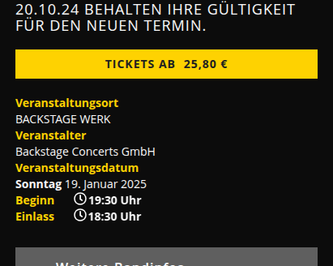

# backstage-timefix for Safari on iOS 

Tha backstage munich has a bug in the mobile page that doesn't show the entry time and start time correctly

This script will fix it on safari for iOS

Before the script:

After the script:

# How to install the script

Install [Userscript](https://apps.apple.com/us/app/userscripts/id1463298887) and activate it.

Copy the backstage-timefix.js to Userscripts directory and activate it for backstage.eu

Note: If the script cannot be found, make sure that the file extension is ".js" and not "js.txt".